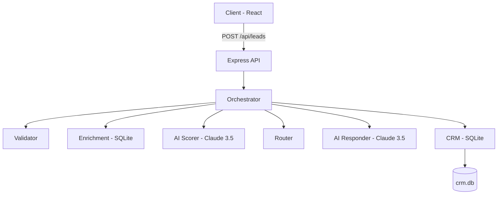

# AI Lead Workflow Automation System

A production-ready AI-driven lead capture and intelligent response handling system.

## Architecture Overview



## Quick Start

1. **Clone and Install**
   ```bash
   git clone <repo-url>
   cd ai-lead-workflow
   npm run install:all
   ```

2. **Configure Environment**
   ```bash
   cp .env.example .env
   # Add your ANTHROPIC_API_KEY to .env
   ```

3. **Run Development Mode**
   ```bash
   npm run dev
   ```

4. **Run Tests**
   ```bash
   npm run test
   ```

5. **Build for Production**
   ```bash
   npm run build
   ```

## Environment Variables

| Key | Type | Default | Required |
|-----|------|---------|----------|
| `ANTHROPIC_API_KEY` | String | - | Yes |
| `PORT` | Number | 3001 | Yes |
| `DATABASE_PATH` | String | ./data/crm.db | Yes |
| `JWT_SECRET` | String | - | Yes |
| `RATE_LIMIT_WINDOW_MS` | Number | 60000 | No |
| `LOG_LEVEL` | String | info | No |

## API Reference

### POST `/api/leads`
Capture a new lead and run the full AI pipeline.
**Request:**
```json
{
  "name": "John Doe",
  "email": "john@acme.co",
  "company": "Acme Corp",
  "role": "CTO",
  "message": "Interested in enterprise plan."
}
```

### GET `/api/leads`
List all leads with pagination and filtering.

### GET `/api/dashboard/stats`
Retrieve summary statistics for the dashboard.

## Module Descriptions

- **Orchestrator**: Manages the multi-stage pipeline flow.
- **AI Scorer**: Uses Claude 3.5 Sonnet to evaluate lead potential.
- **AI Responder**: Generates personalized, tier-aware email responses.
- **CRM**: Handles data persistence and activity logging in SQLite.

## Deployment

### Docker
```bash
docker-compose up --build
```
